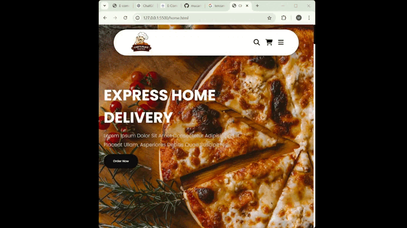

# Restaurant-project
In this project, HTML and CSS features were used and the project was designed full-responsively. Also, for the search, cart and menu buttons the Javascpript event handler methods were used. 
# Preview

